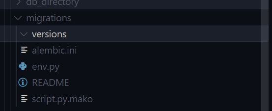

- Step 1
    -  rename the db present to something else
- Step 2
    - activate virtual environment
- Step 3
    - `pip install Flask-Migrate`
    - this internally uses a tool called alembic, which is a schema migration tool
- Step 4
    - add `Flask-Migrate` to `requirements.txt`
- Step 5
    - update `main.py`
        - `from flask_migrate import Migrate`
        - `migrate=Migrate(app,db)`
            - add this after `db.init_app(app)` and before `app.app_context().push()`
- Step 6
    - `$env:ENV="development"`
    -  `$env:FLASK_APP="main.py"`
    - run the above 2 commands in terminal
- Step 7
    - to do the initial setup
        - run :  `flask db init`
        - this will create all the migrations folder,versions,configurations,etc
        - 
        - the above files and folders will be created
- Step 8
    - `flask db migrate -m "DB initial migration"`
    - this goes through the models and create the tables 
    - if we go to migrations/versions folder, we will be able to see a file with above message
    - it will have all the steps required to create the mentioned tables
    - `upgrade` function creates all the tables
    - `downgrade` deletes all the tables
- Step 9
    - note in the video sir deletes the `article_search` table,but we dont have that table in the models for us in experiment 13 zip file,
    - hence we cannot /need not remove it from the migration file
    - delete the `article_search` table in `db initial migration` file
    - at this point we wont have any tables in the database yet, except for alembic_versions - to denote which version the db is right now
- Step 10
    - CMD : `flask db upgrade`
    - version number will be changes and all the tables will be created automatically
- Step 11
    - he is going to create an empty revision
    - so we can add the tables manually
    - `flask db revision -m "add fts"`
    - it will have an empty revision
- Step 12 
    - we will write the migrations manually
    ```

    def upgrade():
        conn = op.get_bind()
        sql = text("""CREATE VIRTUAL TABLE article_search USING fts5(title, content, content=article, content_rowid=article_id, tokenize="porter unicode61");""")
        conn.execute(sql)

    def downgrade():
        op.drop_table("article_search")
    ```
    - add `from sqlalchemy import text` to the migration file

- Step 13:
    - `flask db upgrade`
    - this will add more tables to db
- Step 14:
    - adding triggers
    - `flask db revision -m "add fts related triggers"`
    - this will create another revision file,which will have empty upgrade and downgrade
- Step 15:
    - we will add 3 triggers in upgrade and 3 delete triggers in downgrade function
```

def upgrade():
    conn = op.get_bind()
    sql = text("""
            CREATE TRIGGER article_ai AFTER INSERT ON article BEGIN
              INSERT INTO article_search(rowid, title, content) VALUES (new.article_id, new.title, new.content);
            END;
        """)
    conn.execute(sql)
    sql = text("""
        CREATE TRIGGER article_ad AFTER DELETE ON article BEGIN
          INSERT INTO article_search(article_search, rowid, title, content) VALUES('delete', old.article_id, old.title, old.content);
        END;
    """)
    conn.execute(sql)

    sql = text("""
        CREATE TRIGGER article_au AFTER UPDATE ON article BEGIN
          INSERT INTO article_search(article_search, rowid, title, content) VALUES('delete', old.article_id, old.title, old.content);
          INSERT INTO article_search(rowid, title, content) VALUES (new.article_id, new.title, new.content);
        END;   
        """)
    conn.execute(sql)

    sql = text(""" INSERT INTO article_search(article_search) VALUES('rebuild') """)
    conn.execute(sql)    

def downgrade():
    conn = op.get_bind()
    sql = text(""" DROP TRIGGER article_ai """)
    conn.execute(sql)
    sql = text(""" DROP TRIGGER article_ad """)
    conn.execute(sql)
    sql = text(""" DROP TRIGGER article_au """)
    conn.execute(sql)
```
 - also dont forget to add `from sqlalchemy import text`
- Step 16:
    - `flask db upgrade`
        - now 3 triggers will be added

- Step 17:
    - lets say we want to create two more models
    - Note at this point we will add two more models to the table
    ```
    class Category(db.Model):
        __tablename__ = 'category'
        category_id = db.Column(db.Integer, primary_key=True, autoincrement=True)
        title = db.Column(db.String)
        slug = db.Column(db.String, unique=True)

    class ArticleCategories(db.Model):
        __tablename__ = 'article_categories'    
        article_id = db.Column(db.Integer, db.ForeignKey("article.article_id"), primary_key=True)
        category_id = db.Column(db.Integer, db.ForeignKey("category.category_id"), primary_key=True)

    ```
    - `flask db migrate -m "adding article categories"`
    - in this migration it will also try to drop tables,
    because `article_search_idx` and similar tables dont exist in our models
    - but it exists in our database
    - so lets make the migrations to stop deleting the table automatically
    - its also trying to update the article_search, as it a virtual table, we dont want it to migrate automatically
    - so delete the migration
- Step 18:
    - in models.py mark the articlesearch table as virtual table
        - `__table_args__ = {'info': dict(is_virtual=True)}`
- Step 19:
    - how to exclude the virtual table during migration?
    - go to env.py
    - `https://alembic.sqlalchemy.org/en/latest/cookbook.html#rudimental-schema-level-multi-tenancy-for-postgresql-databases`
    - write a function called include_object before get_metadata()
```
def include_object(object, name, type_, reflected, compare_to):    
    print("name", name)
    if type_ == "table" and reflected and compare_to is None:
        return False
    else:
        if object.info.get('is_virtual', False):
            print("is_virtual")
            return False
        else:
            return True
```
    - what does the above function do?
        - if type of object is table and its not in database,then dont delete
        - else  
            - if the table type is virtual , return False
            - else return true
- Step 20:
    - `include_object=include_object`
        - add this to `url` variable of `run_migrations_offline` inside context.configure
        - and also add the same inside `with connectable.connect()` between lines 90-100 after the ` process_revision_function`

- Step 21:
    - since we deleted the migration ,we rerun it `flask db migrate -m "adding article categories"`
- step 22:
    - `flask db upgrade`
    - we will be able to see the new models
    - `flask db history`
        - will show the migration history till the current state of the db
    - if i downgrade,the category and article_category will be deleted
    - `flask db head`
        - will tell us what level we are
    - upon upgrading we will get the table back again
- Step 23:
    - delete the database
    - `flask db upgrade`
        - this will run everything
